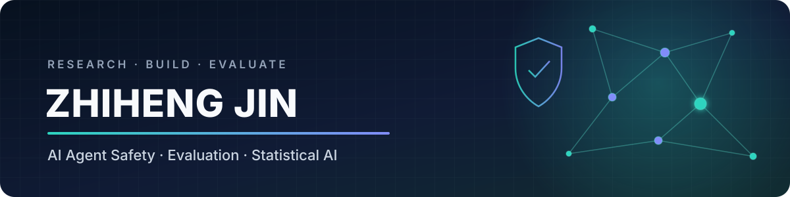

  

  

  

  
  
  

> I build benchmarks, datasets, and evaluation systems for safer AI agents—across lifecycle-aware defenses, GUI environments, and financial workflows.

---

## 🔭 Research Focus

  <b>Student Researcher · Shanghai University of Finance and Economics (SUFE)</b>

- 🛡️ **AI Agent Safety** — prompt injection, tool-use risk, memory poisoning, and lifecycle-aware defense
- 🧪 **Evaluation & Red Teaming** — reproducible benchmarks, attack/defense metrics, and multi-model judging
- 🖥️ **GUI Agent Security** — safety evaluation across desktop, mobile, web, and cross-device workflows
- 📊 **Statistical AI** — reliable, executable data analysis with agentic workflows

---

## 📄 Publication

| Paper | Contribution | Status |
|:---|:---|:---:|
| **[Spider-Sense: Intrinsic Risk Sensing for Efficient Agent Defense with Hierarchical Adaptive Screening](https://arxiv.org/abs/2602.05386)** | Event-driven agent defense and the lifecycle-aware **S²Bench** benchmark; co-author |  |

**Result highlight:** Spider-Sense reports the lowest attack success and false-positive rates in its evaluation, with approximately **8.3% latency overhead**.

---

## 🚀 Featured Work

| Project | What it does | Highlights |
|:---|:---|:---|
| **[GUIHazard](https://github.com/eriiemefritzruss-collab/guihazard)** | Cross-platform security benchmark for GUI agents | Desktop · Mobile · Web; misuse, prompt injection, model misbehavior, and five cross-platform attack families |
| **[FinSafetyEval](https://github.com/eriiemefritzruss-collab/FinSafetyEval)** | Financial-domain LLM safety evaluation and red-teaming pipeline | 4,000 traceable regulatory cases; multi-judge evaluation; ASR analysis; human-review exports |
| **[FinVault](https://github.com/eriiemefritzruss-collab/finvault)** | Minimal anonymized release of a financial-agent safety dataset | Offline validation, privacy checks, attack and normal-business scenarios |
| **[StatBot](https://github.com/eriiemefritzruss-collab/StatBot)** | Statistics-first data analysis agent | Statistical tool routing, session memory, isolated execution, graceful model-timeout fallback |
| **[Spider-Sense](https://github.com/aifinlab/Spider-Sense)** | Event-driven defense for autonomous agents | Intrinsic Risk Sensing + Hierarchical Adaptive Screening across query, plan, action, and observation stages |

---

## 🧭 Selected Highlights

- Built a unified GUI-agent safety framework covering **three platforms** and cross-device threat paths.
- Developed a financial red-teaming pipeline grounded in **4,000 real, traceable enforcement cases** rather than synthetic source records.
- Packaged an anonymized financial-agent safety dataset with automated integrity and privacy-leakage checks.
- Extended a data-analysis agent with statistics-oriented tools, session-safe execution, and robust local fallbacks.

---

## 🛠️ Tech Stack

<b>Languages & Engineering</b> 

<b>Agents & Evaluation</b> 

<b>Domains</b> 

---

  <picture>
    <source media="(prefers-color-scheme: dark)" srcset="https://raw.githubusercontent.com/eriiemefritzruss-collab/eriiemefritzruss-collab/output/github-contribution-grid-snake-dark.svg">
    <source media="(prefers-color-scheme: light)" srcset="https://raw.githubusercontent.com/eriiemefritzruss-collab/eriiemefritzruss-collab/output/github-contribution-grid-snake.svg">
    
  </picture>

  <i>“Safe agents need more than guardrails—they need to sense risk before they act.”</i>

